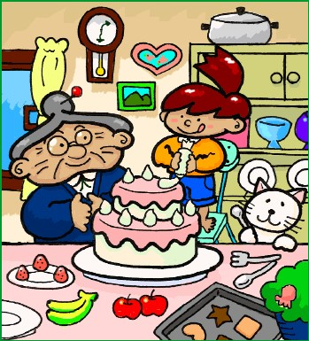
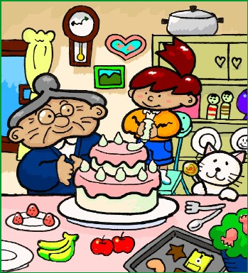
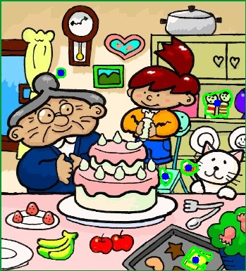

# 🔁 ChangeDetection 2.0 — SAM-Powered Difference Detector

> *“A simple math-based spot-the-difference model, enhanced using SAM model.”*

---

## 📸 Image Comparison Demo

| 🖼️ Image A | 🖼️ Image B | 🖼️ Image B |
|-----------|-----------|-----------|
|  |  |  |

⬇️ **Segmented Difference Output**  
<p align="center">
  
</p>

---

Okay, so basically this is my new attempt at making a smarter change detection model —  
not just the boring:

> “Something changed here”

But more like:

> “Yo, this button shifted to the left... and this section over here got replaced with something new.”

The whole idea is to **segment out what actually changed** between two images (UI, scenes, etc.) using this clean combo:

- 📐 Basic **image difference** → `difference = img1 - img2`
- 🔍 **Contour-based region extraction** on the diff mask to point prompt the segmentation
- 🤖 **SAM (Segment Anything Model)** to get precise masks of changed objects

---

## 💡 What's Done So Far

I’ve already got the core pipeline running:
- Take two images (before and after)
- Do a diff to get changed regions
- Use **contour detection** to extract areas that seem to have changed
- Pass those as input points into **SAM** to get exact masks of what changed


So visually, here’s what the pipeline looks like:

```plaintext
Image A   Image B
   │         │
   └──▶ Diff Mask ──▶ Contour Detection ──▶ SAM Segments
                                   │
                         (Region-level Change Maps)
```

## Btw there is no ChangeDetection 1.0 on GitHub — that was my internship project under NDA, so can't share it here. Respect ✊.##